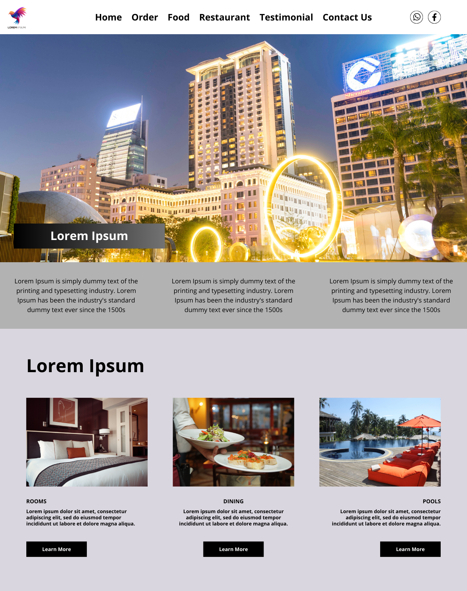

# Simple-hotel-website-HTML-CSS 🏨

A clean and responsive hotel landing page created using **HTML5** and **CSS3**. This project demonstrates front-end skills including semantic HTML structure, responsive layout using Flexbox, and UI design using only HTML and CSS.

---

## 🌐 Live Preview

➡️ [Live Demo](https://yourusername.github.io/Simple-hotel-website-HTML-CSS/)  
*

---

## 🧰 Tech Stack

- HTML5
- CSS3
- Flexbox & Layouts
- Font Awesome (CDN)

---

## 📸 Screenshots



---

## 📁 Project Structure

Simple-hotel-website-HTML-CSS/
├── index.html # Main landing page
├── style.css # CSS styles (optional if separated)
├── heroimg.jpg # Hero section image
├── rooms.jpg # Services image - rooms
├── dining.jpg # Services image - dining
├── pool.jpg # Services image - pool
└── README.md # Project documentation


---

## ✨ Features

- Navigation bar with logo and icons
- Hero section with image and heading overlay
- Informational cards
- Service cards (Rooms, Dining, Pools)
- Responsive layout using Flexbox
- Font Awesome icons integration

---

## 📦 How to Run Locally

1. Clone the repository:
```bash
git clone https://github.com/yourusername/Simple-hotel-website-HTML-CSS.git

2. open the project floder:
cd Simple-hotel-website-HTML-CSS

3.open index.html in any browser.
